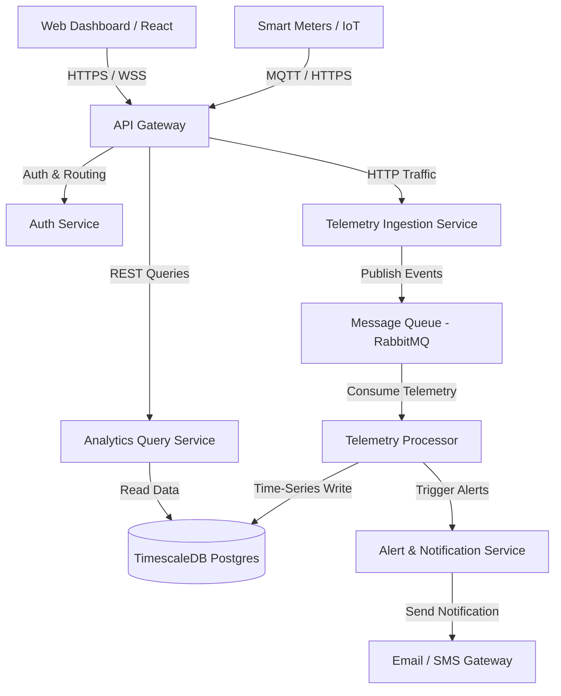

# EcoSync System Architecture & Design

This document details the high-level system architecture, data ingestion pipelines, and database modeling for the EcoSync platform.

---

## 1. System Overview

EcoSync is composed of decoupled microservices that communicate asynchronously using a message broker (RabbitMQ/Kafka) and expose interfaces via an API Gateway.

---

## 2. Core Components

### 2.1 API Gateway
- **Technology:** Kong or Traefik.
- **Responsibilities:** Rate limiting, JWT validation, SSL termination, and request routing to backend microservices.

### 2.2 Telemetry Ingestion Service
- **Technology:** Node.js (Express) or Go.
- **Responsibilities:** Exposes high-throughput HTTP endpoints and an MQTT broker bridge to accept incoming telemetry from IoT smart meters. Publishes events directly to the message queue.

### 2.3 Telemetry Processor (Backend worker)
- **Technology:** Python or Go.
- **Responsibilities:** Consumes events from the queue, performs data validation, sanitizes inputs, flags anomalies, and stores records in TimescaleDB.

### 2.4 Database Layer
- **Technology:** PostgreSQL with TimescaleDB extension.
- **Responsibilities:** Maintains relational tables (users, meter registry, settings) and time-series hyper-tables (telemetry points).

### 2.5 Analytics Query Service
- **Technology:** Go or Node.js.
- **Responsibilities:** Implements endpoints for retrieving historical aggregates, carbon offset metrics, and reporting.

### 2.6 Frontend Client
- **Technology:** Next.js (React), Tailwind CSS, Chart.js / Recharts.
- **Responsibilities:** Server-side rendered web app with real-time WebSocket dashboard widgets, analytics reports, and administration modules.
.
